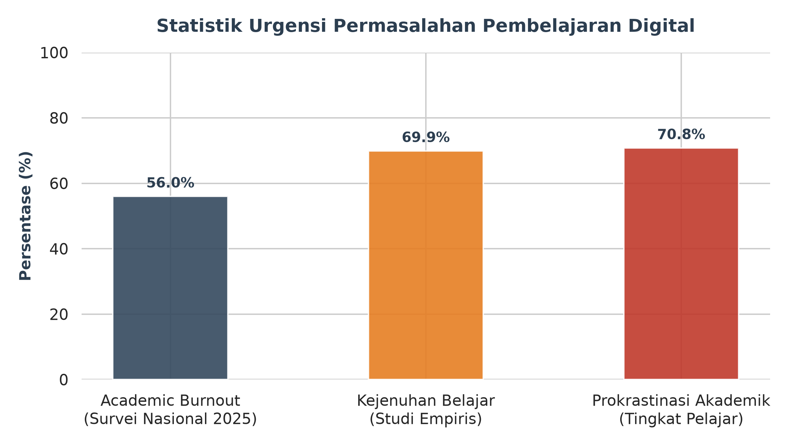
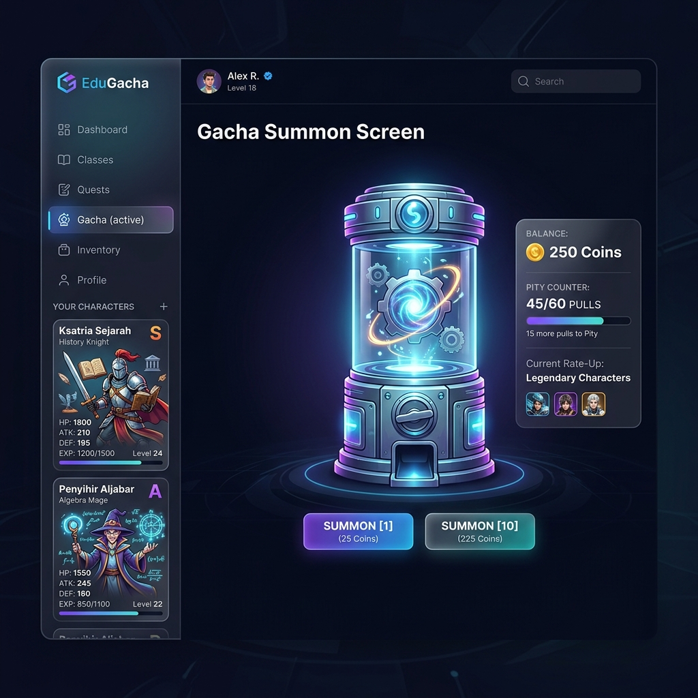
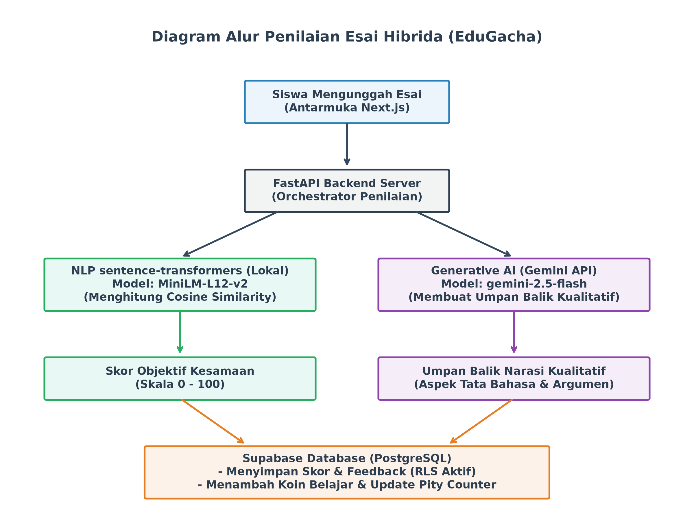
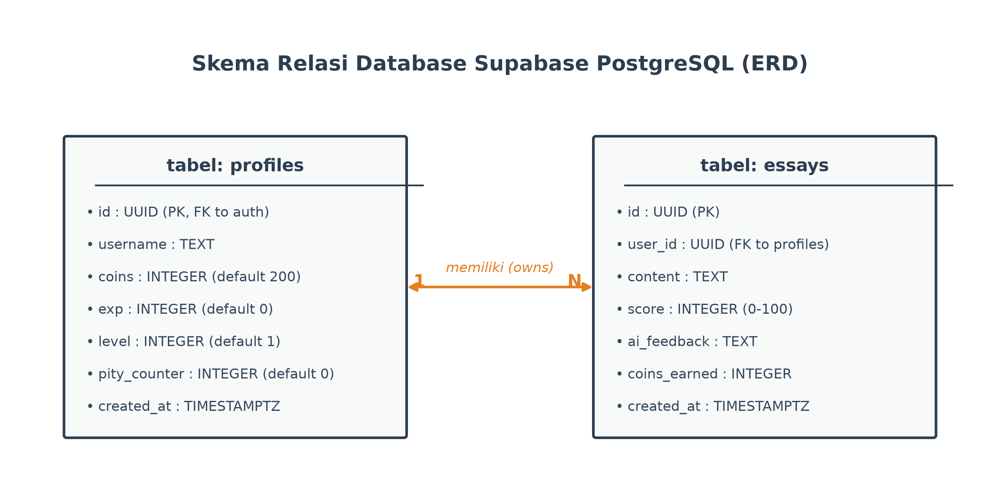

# PENDAHULUAN

Integrasi teknologi dalam dunia pendidikan telah melahirkan pergeseran paradigma dari pembelajaran konvensional menuju ekosistem digital. *Learning Management System* (LMS) kini menjadi tulang punggung administrasi akademik di berbagai jenjang pendidikan untuk mendistribusikan materi dan mengelola tugas secara efisien (Abidin, 2025). Namun, dalam implementasinya, LMS konvensional sering kali terjebak pada fungsi administratif yang kaku, sehingga siswa merasa terisolasi dalam tumpukan tugas tanpa interaksi yang bermakna. Proses belajar yang pasif dan berulang ini memicu kejenuhan belajar digital (*academic burnout*) serta peningkatan drastis pada tingkat prokrastinasi akademik di kalangan generasi muda, khususnya Generasi Z. Data survei nasional pada tahun 2025 menunjukkan bahwa 56% responden pelajar mengalami *academic burnout*, yang diperkuat oleh studi empiris yang mencatat bahwa 69,9% siswa mengalami kejenuhan belajar tingkat sedang hingga tinggi akibat sistem pembelajaran digital yang monoton (Nurani dkk., 2022). Dampak lanjutannya adalah tingginya prevalensi prokrastinasi akademik yang menembus angka 70,8% di kalangan pelajar akibat kelelahan mental yang mendorong mereka menunda-nunda tugas akademik (seperti yang divisualisasikan pada Gambar 1 dan Gambar 2). Karakteristik Generasi Z yang menyukai umpan balik instan dan interaktivitas tinggi membuat LMS yang statis justru memadamkan motivasi belajar intrinsik mereka.

Di tengah kejenuhan motivasi tersebut, metode evaluasi penulisan esai yang idealnya menjadi sarana interaktif juga menghadapi kendala besar. Meskipun penulisan esai diakui secara luas sebagai instrumen terbaik untuk melatih kemampuan berpikir kritis dan artikulasi argumen siswa (Pradani & Suadaa, 2023), proses koreksinya secara manual membutuhkan waktu yang sangat lama dan rentan terhadap subjektivitas pendidik. Keterbatasan waktu pengajar sering kali membuat umpan balik kognitif yang diterima siswa menjadi sangat minim dan terlambat. Ketiadaan umpan balik yang cepat (*instant feedback*) menghalangi siswa untuk memahami kelemahan tulisan mereka pada saat motivasi belajar mereka sedang berada di puncaknya, sehingga mengurangi efektivitas esai sebagai media pembelajaran interaktif.

Selain kendala dalam evaluasi tertulis, penurunan motivasi belajar ini juga diperparah oleh monotonnya sistem penghargaan (*reward*) dalam pembelajaran digital. Upaya menyuntikkan elemen permainan (gamifikasi) konvensional seperti poin dan papan peringkat terbukti hanya memberikan dorongan motivasi jangka pendek karena tidak memiliki nilai guna nyata (*utility*) bagi siswa (Oliveira dkk., 2023). Di sisi lain, adopsi mekanisme undian acak (*gacha*) dari industri hiburan memiliki daya tarik psikologis yang kuat untuk memicu keterlibatan aktif, tetapi berisiko menimbulkan frustrasi mendalam apabila siswa merasa keberuntungan mereka diperlakukan tidak adil oleh sistem. Tanpa adanya batas pengaman yang berkeadilan seperti algoritma *pity system* untuk menjamin hadiah setelah sejumlah kegagalan tertentu, sistem penghargaan acak justru dapat memicu kecanduan patologis dan kecemasan akademik (Thavamuni dkk., 2025).

Guna menjawab tantangan sistemik tersebut, pengembangan platform EduGacha hadir sebagai langkah strategis yang menawarkan solusi hibrida dengan menyeimbangkan kecerdasan buatan dan gamifikasi yang adil. Melalui integrasi *Natural Language Processing* (NLP) berbasis *Cosine Similarity*, esai siswa dapat dinilai secara objektif dalam hitungan detik, sementara saran perbaikan kualitatif diberikan secara instan menggunakan Gemini AI. Koin hasil belajar kemudian dapat ditukarkan pada mesin gacha yang dilengkapi algoritma *pity system* sebagai jaminan keadilan penghargaan. Implementasi platform ini menjadi sangat mendesak demi mentransformasi LMS dari sekadar tempat pengumpulan tugas administratif menjadi petualangan akademik yang interaktif dan memikat, sekaligus mempersiapkan sumber daya manusia unggul menyongsong Indonesia Emas 2045. Oleh karena itu, gagasan ini bertujuan untuk menguraikan konsep arsitektur, kelayakan teknis (feasibility), serta tahapan strategis implementasi EduGacha sebagai solusi inovatif pembelajaran digital.

# PEMBAHASAN

**Tinjauan Konseptual Ekosistem EduGacha**

Platform EduGacha dirancang untuk mentransformasi sistem pembelajaran digital dengan mengintegrasikan aspek psikologi permainan (gamifikasi) dan kecerdasan buatan. Model pembelajaran konvensional pada LMS yang cenderung monoton dan hanya berfokus pada pengumpulan tugas administratif diubah menjadi ekosistem yang interaktif. Di dalam platform ini, seluruh tugas penulisan esai, penyelesaian kuis, dan aktivitas kelas didefinisikan sebagai misi belajar atau quest layaknya permainan peran (Role-Playing Game atau RPG). Siswa diberikan otonomi penuh untuk memilih quest yang sesuai dengan tingkat minat dan kemampuan mereka. Sebelum diserahkan, siswa dapat menulis dan menyusun draf esai mereka secara langsung pada halaman penulisan esai (seperti yang ditunjukkan pada Gambar 3). Setiap kali siswa berhasil menyelesaikan sebuah quest berupa esai, hasil pekerjaan mereka akan dikoreksi dan dinilai secara otomatis oleh mesin AI backend, kemudian umpan balik kualitatif serta skor kelayakan akan langsung ditampilkan di antarmuka halaman evaluasi esai (seperti yang ditunjukkan pada Gambar 4). Nilai hasil belajar tersebut kemudian dikonversikan menjadi Koin EduGacha berdasarkan bobot kesulitan tugas yang diselesaikan.

Koin yang telah dikumpulkan oleh siswa berfungsi sebagai mata uang virtual untuk ditukarkan di halaman mesin gacha. Siswa dapat melakukan undian acak untuk mengumpulkan berbagai kartu karakter bertema pendidikan, seperti "Ksatria Sejarah" untuk bidang ilmu sosial atau "Penyihir Aljabar" untuk bidang matematika. Setiap kartu karakter tidak hanya memiliki nilai visual yang menarik, melainkan juga dilengkapi dengan informasi mendalam berupa kutipan motivasi dari tokoh dunia, fakta ilmiah unik, dan rangkuman materi pembelajaran penting. Koleksi kartu ini akan disimpan di dalam binder digital portofolio siswa. Binder portofolio ini dapat dibagikan ke media sosial sebagai pembuktian pencapaian akademik mereka, dicetak secara fisik, atau ditukarkan dengan hadiah dunia nyata (seperti voucer belajar atau beasiswa) melalui program kemitraan sponsor. Konsep visual dari antarmuka mesin gacha dan binder portofolio kartu digital ini dapat dilihat pada Gambar 5.

**Analisis Kelayakan dan Implementasi Teknis (Feasibility)**

Platform EduGacha dikembangkan dengan arsitektur teknis modern berbasis FastAPI sebagai server backend dan Supabase sebagai layanan manajemen database dan autentikasi. Arsitektur ini dipilih untuk menjamin pemrosesan data yang cepat, stabil, dan aman dari kecurangan. Alur kerja backend platform ini membagi proses penilaian esai hibrida dan kalkulasi gacha secara modular demi kestabilan sistem (seperti yang divisualisasikan pada Gambar 6).

Dalam penerapannya, sistem penilaian esai hibrida mengombinasikan kecepatan pemrosesan *Natural Language Processing* (NLP) lokal dengan kedalaman analisis *Generative AI*. Proses evaluasi esai ini berjalan dalam dua tahapan utama, dimulai dari penilaian objektif semantik menggunakan server FastAPI yang menerima input esai siswa lalu memprosesnya secara lokal dengan model *sentence-transformers* berarsitektur *paraphrase-multilingual-MiniLM-L12-v2*. Model tersebut mengubah esai siswa ($E_{\text{siswa}}$) dan acuan jawaban guru ($E_{\text{acuan}}$) menjadi vektor embedding berdimensi tinggi, di mana skor kemiripan semantik dihitung berdasarkan rumus Kesamaan Kosinus (*Cosine Similarity*) untuk menilai relevansi isi secara objektif (Lahitani, 2022):

$$\text{Kesamaan Kosinus}(E_{\text{siswa}}, E_{\text{acuan}}) = \frac{E_{\text{siswa}} \cdot E_{\text{acuan}}}{\|E_{\text{siswa}}\| \times \|E_{\text{acuan}}\|}$$

Nilai kesamaan vektor ini memformulasikan skor objektif dalam skala 0 hingga 100 yang mencerminkan tingkat relevansi esai siswa terhadap acuan jawaban guru secara presisi tanpa bias subjektivitas manusia. Tahap kedua dilanjutkan dengan analisis kualitatif melalui API model gemini-2.5-flash yang menerima teks esai siswa beserta skor semantik untuk dianalisis berdasarkan indikator struktur argumen, penggunaan tata bahasa, dan kekayaan kosa kata. Hasil generatif model ini membuahkan umpan balik (*feedback*) suportif sebanyak 2-3 kalimat dalam bahasa Indonesia untuk memotivasi siswa sekaligus menunjukkan bagian tulisan yang perlu diperbaiki secara mandiri.

Meskipun integrasi kecerdasan buatan menawarkan efisiensi tinggi, sistem evaluasi otomatis ini memiliki keterbatasan berupa kerentanan terhadap manipulasi jawaban oleh siswa. Siswa dapat mengeksploitasi algoritma Kesamaan Kosinus dengan cara memasukkan daftar kata kunci akademis secara acak tanpa membentuk kalimat yang koheren demi mendongkrak skor kemiripan semantik. Guna memitigasi celah manipulasi tersebut, peran Gemini AI diposisikan sebagai kurator kualitatif lapis kedua yang tidak hanya memberikan saran perbaikan, tetapi juga memvalidasi kelogisan berpikir dan struktur sintaksis esai. Apabila Gemini AI mendeteksi ketidakselarasan logika atau pola teks yang sengaja dimanipulasi, sistem backend akan memicu penyesuaian skor secara otomatis untuk mencegah kecurangan akademik. Di samping itu, keandalan sistem tetap terjaga di area dengan keterbatasan koneksi internet karena model pemrosesan bahasa alami lokal pada server FastAPI tetap dapat memberikan penilaian kuantitatif dasar secara luring sebelum umpan balik kualitatif Gemini AI disinkronisasikan saat koneksi kembali stabil.

Selain penilaian esai, untuk mengeliminasi dampak negatif dari ketidakpastian keberuntungan gacha konvensional yang dapat memicu frustrasi belajar, platform ini menggunakan sistem belas kasih atau *pity system* yang dikelola secara terpusat pada server FastAPI. Algoritma ini dirancang dengan menetapkan peluang dasar mendapatkan kartu tingkat kelangkaan tertinggi (*Legendary*) sebesar 3%, sementara kartu tingkat *Epic* memiliki peluang 12%, *Rare* 25%, dan *Common* sebesar 60%. Melalui mekanisme jaminan hadiah (*pity*), setiap kali siswa melakukan undian gacha namun gagal mendapatkan kartu *Legendary*, nilai *pity counter* pada sistem akan bertambah 1 poin secara otomatis. Perubahan probabilitas perolehan kartu *Legendary* tersebut diformulasikan secara matematis sebagai berikut:

$$P(\text{Legendary}) = \begin{cases} 3\%, & \text{jika jumlah tarikan} < 60 \\ 100\%, & \text{pada tarikan ke-60} \end{cases}$$

Jika *pity counter* telah mencapai tarikan ke-60, sistem backend secara otomatis memaksa probabilitas mendapatkan kartu *Legendary* menjadi 100% guna menjamin siswa memperoleh hadiah utama tersebut, kemudian mereset *pity counter* kembali ke angka 0. Penerapan algoritma berkeadilan ini memastikan setiap dedikasi belajar siswa mendapat apresiasi yang setimpal secara konsisten dan meminimalkan kekecewaan akibat faktor keberuntungan semata.

Seluruh data transaksi koin, riwayat pengerjaan esai, koleksi kartu, dan status *pity* gacha tersebut disimpan secara aman di dalam database Supabase PostgreSQL. Struktur basis data relasional ini bertumpu pada interaksi dua tabel utama, yakni tabel *profiles* dan tabel *essays*. Tabel *profiles* berfungsi menyimpan profil siswa seperti identitas unik pengguna (*UUID*), saldo koin belajar, tingkat level akun, akumulasi *pity counter*, serta catatan waktu pembuatan akun. Di sisi lain, tabel *essays* mencatat riwayat pengerjaan tugas esai yang mencakup identitas tugas, kunci relasi pengguna (*foreign key*), konten tulisan esai, skor kelayakan hasil pengolahan NLP, catatan umpan balik AI kualitatif, koin hasil belajar yang diperoleh, serta waktu pengumpulan tugas.

Untuk melindungi integritas data, platform ini mengaktifkan Row Level Security (RLS) di Supabase. Kebijakan RLS memastikan siswa hanya dapat melihat atau mengubah data milik mereka sendiri secara terotentikasi, sehingga mencegah celah manipulasi jumlah koin atau nilai esai. Skema database ini divisualisasikan pada Gambar 7.

Dari aspek operasional dan keberlanjutan finansial, arsitektur teknologi yang dipilih untuk EduGacha sangat efisien sehingga layak untuk diadopsi oleh institusi pendidikan dengan anggaran terbatas. Penggunaan model representasi bahasa berbasis server FastAPI lokal meniadakan biaya pemanggilan antarmuka pemrograman aplikasi pihak ketiga untuk setiap penilaian esai kuantitatif, sehingga beban komputasi harian dapat ditanggung secara mandiri oleh infrastruktur sekolah tanpa biaya langganan tambahan. Pemanggilan layanan Gemini AI berbayar dibatasi hanya pada tahap finalisasi pengumpulan tugas esai untuk keperluan umpan balik kualitatif mendalam, bukan pada setiap draf revisi mandiri siswa. Dengan skema operasional hibrida ini, biaya operasional platform dapat ditekan seminimal mungkin tanpa mengorbankan kualitas penilaian personal yang diterima oleh setiap siswa.

Realisasi platform EduGacha membutuhkan kolaborasi erat dari berbagai pemangku kepentingan agar dapat diimplementasikan secara optimal di lapangan. Sinergi ini melibatkan institusi pendidikan seperti sekolah dan universitas sebagai penyedia infrastruktur belajar sekaligus fasilitator integrasi kelas, didukung oleh peran aktif guru dan dosen dalam merancang materi ajar serta mengunggah kunci jawaban acuan ke dalam sistem. Di sisi teknis, pengembang aplikasi bertanggung jawab penuh atas pemeliharaan server FastAPI, peningkatan akurasi model AI, dan perbaikan sistem keamanan. Sementara itu, mitra sponsor dari korporasi EdTech, program tanggung jawab sosial perusahaan (CSR), maupun lembaga beasiswa berkontribusi sebagai penyedia hadiah dunia nyata untuk ditukar dengan koleksi kartu prestasi siswa. Implementasi ini berjalan dalam linimasa bertahap yang dimulai dari perancangan antarmuka Next.js dan sistem autentikasi Supabase pada bulan pertama hingga kedua, dilanjutkan dengan tahap uji coba terbatas (*pilot project*) di sekolah mitra pada bulan ketiga hingga keempat untuk mengevaluasi respons psikologis siswa, dan ditutup dengan rilis publik serta evaluasi efisiensi operasional platform mulai bulan kelima ke atas.

**Dampak dan Potensi Kebermanfaatan**

Penerapan platform EduGacha diyakini akan membawa dampak positif yang signifikan bagi ekosistem pendidikan digital nasional. Terutama dalam merevitalisasi motivasi belajar siswa dari ekstrinsik menjadi motivasi intrinsik jangka panjang. Berdasarkan *Self-Determination Theory*, integrasi fitur otonomi dalam memilih misi belajar, pemenuhan kompetensi lewat koreksi esai instan AI, dan keterkaitan sosial dari berbagi portofolio kartu digital terbukti ampuh mendorong keterlibatan aktif siswa serta kepuasan pembelajaran yang lebih konsisten (Almufarreh, 2026; Grubješić dkk., 2026). Dampak berikutnya adalah demokratisasi penilaian berkualitas, di mana sekolah-sekolah di wilayah tertinggal yang mengalami keterbatasan staf pengajar dapat menghadirkan layanan evaluasi esai mendalam secara instan tanpa beban operasional yang mahal. Selain itu, EduGacha menjadi katalisator stimulasi berpikir kritis yang efektif, menggantikan kebiasaan pembelajaran hafalan kaku pada kuis pilihan ganda konvensional menjadi latihan penulisan argumen ilmiah yang runtut dan berstruktur demi memperoleh poin apresiasi akademik.

# PENUTUP

EduGacha hadir sebagai repositori inovasi digital yang berhasil mentransformasikan pola pembelajaran konvensional yang kaku dan monoton menjadi ekosistem akademik yang dinamis, interaktif, dan berkeadilan. Dengan mengintegrasikan sistem penilaian esai hibrida yang memadukan keakuratan semantik lokal melalui model pemrosesan bahasa alami berbasis *Cosine Similarity* dan analisis kualitatif personal oleh Gemini AI, platform ini mampu mengatasi kendala keterlambatan umpan balik kognitif sekaligus meminimalkan subjektivitas penilaian pendidik. Solusi inovatif ini semakin diperkuat dengan implementasi mekanisme penghargaan gamifikasi terarah yang dilengkapi algoritma *pity system*, yang secara efektif memitigasi risiko frustrasi belajar akibat ketidakpastian keberuntungan gacha konvensional. Melalui pemenuhan kebutuhan psikologis dasar berupa otonomi, kompetensi, dan keterkaitan sosial, EduGacha tidak hanya mampu mereduksi prevalensi *academic burnout* dan prokrastinasi akademik di kalangan Generasi Z, tetapi juga merevitalisasi motivasi belajar intrinsik mereka demi mewujudkan sumber daya manusia unggul yang siap menyongsong Indonesia Emas 2045.

Untuk memaksimalkan keberhasilan implementasi platform EduGacha secara luas, sinergi kolaboratif antarpemangku kepentingan sangatlah krusial untuk dilaksanakan secara terencana. Pengelola institusi pendidikan diharapkan segera menyiapkan sarana infrastruktur teknologi informasi yang memadai, sementara para pengajar secara aktif menyusun instrumen bahan ajar serta jawaban acuan berkualitas tinggi yang relevan dengan kebutuhan kurikulum. Bagi tim pengembang aplikasi, pemeliharaan berkala pada server backend FastAPI, penyempurnaan basis data Supabase, serta optimasi efisiensi model pemrosesan bahasa alami lokal harus terus diupayakan guna menjaga keamanan dan stabilitas platform dari potensi kecurangan. Terakhir, kemitraan strategis dengan berbagai pihak sponsor eksternal perlu diperluas guna menyediakan opsi penukaran hadiah dunia nyata yang bernilai guna bagi siswa, sehingga siklus gamifikasi akademik yang telah dirancang dapat terus berjalan secara berkelanjutan dan memberikan dampak nyata bagi peningkatan kualitas pendidikan nasional.

# DAFTAR PUSTAKA

Abidin, M. M. (2025). Adopsi Google Classroom Menggunakan Extended Technology Acceptance Model (EX-TAM). *UJMC (Unisda Journal of Mathematics and Computer Science)*, 11(1), 10-18. https://doi.org/10.52166/ujmc.v11i1.10426

Almufarreh, A. (2026). Gamification in Education and Its Impact on Student Academic Performance: A Conceptual Model Based on Systematic Literature Review and PLS-SEM Analysis. *Algorithms*, 19(2), 143. https://doi.org/10.3390/a19020143

Grubješić, I., Ivanjko, T., & Hajdek, M. (2026). Gamification and Course Satisfaction in English for Specific Purposes: A Self-Determination Theory Perspective. *Education Sciences*, 16(4), 629. https://doi.org/10.3390/educsci16040629

Lahitani, A. R. (2022). Automated Essay Scoring menggunakan Cosine Similarity pada Penilaian Esai Multi Soal. *Jurnal Kajian Ilmiah*, 22(2), 107-118. https://doi.org/10.31599/jki.v22i2.1121

Nurani, G. A., Nafis, R. Y., Ramadhani, A. N., Prastiwi, M., Hanif, N., & Ardianto, D. (2022). Online Learning Impacts on Academic Burnout: A Literature Review. *Journal of Digital Learning and Education*, 2(3), 133-143. https://doi.org/10.52562/jdle.v2i3.433

Oliveira, W., Hamari, J., Shi, L., Toda, A. M., Rodrigues, L., Palomino, P. T., & Isotani, S. (2023). Tailored gamification in education: A literature review and future agenda. *Education and Information Technologies*, 28(1), 373-406. https://doi.org/10.1007/s10639-022-11122-4

Pradani, K. A., & Suadaa, L. H. (2023). Automated Essay Scoring Menggunakan Semantic Textual Similarity Berbasis Transformer Untuk Penilaian Ujian Esai. *Jurnal Teknologi Informasi dan Ilmu Komputer*, 10(6), 1177-1184. https://jtiik.ub.ac.id/index.php/jtiik/article/view/7338

Thavamuni, S., Khalid, M. N. A., & Iida, H. (2025). Inherent Addiction Mechanisms in Video Games' Gacha. *Information*, 16(10), 890. https://doi.org/10.3390/info16100890

